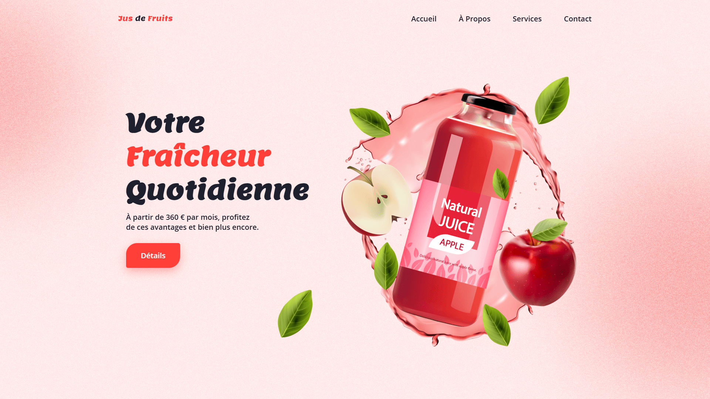

<div align="center">  
  <a href="https://background-animation-juice.netlify.app/" target="_blank">  
      
  </a>  
  </br></br>  
  <h3 align="center">🍎 Animation de Fond &nbsp;–&nbsp; Jus de Fruits</h3>  
</div>

## <br /> 📌 Sommaire

&nbsp;&nbsp;&nbsp; 🎨 &nbsp; [**Introduction**](#introduction)<br />
&nbsp;&nbsp;&nbsp; 🛠️ &nbsp; [**Technologies**](#technologies)<br />
&nbsp;&nbsp;&nbsp; 🎯 &nbsp; [**Fonctionnalités**](#fonctionnalités)<br />
&nbsp;&nbsp;&nbsp; 🚀 &nbsp; [**Installation**](#installation)<br />

## <br /> <a name="introduction">🎨 Introduction</a>

Landing page dynamique et rafraîchissante, animée avec **GSAP** et **TweenMax**. Elle met en scène des visuels vitaminés (jus, pommes, feuilles) dans un univers coloré et responsive.

Parfaite pour promouvoir des marques de jus, produits naturels ou projets liés au bien-être, chaque élément flotte ou surgit avec fluidité pour offrir une expérience moderne, vive et gourmande.

## <br /> <a name="technologies">🛠️ Technologies</a>

- HTML5 sémantique et accessible
- CSS3 moderne avec variables, media queries et animations
- JavaScript ES6 clair et modulaire
- [GSAP + TweenMax](https://greensock.com/gsap/) pour les animations
- [Remix Icons](https://remixicon.com/) pour les icônes vectorielles

## <br /> <a name="fonctionnalités">🎯 Fonctionnalités</a>

- Animations de feuilles, pommes, liquide et texte via TweenMax
- Illustration dynamique de boisson fruitée
- Effets de flottaison et apparitions séquentielles
- Navigation fluide avec menu responsive
- Design mobile-first 100% adaptatif
- Visuels SVG positionnés dynamiquement
- Palette de couleurs fraîche et estivale
- Typographie sur mesure via Open Sans et Lemon

## <br /> <a name="installation">🚀 Installation</a>

### ✅ Prérequis

- [Google Chrome](https://www.google.com/) — Navigateur moderne
- [Visual Studio Code](https://code.visualstudio.com/) — Éditeur de code
- [Live Server](https://marketplace.visualstudio.com/items?itemName=ritwickdey.LiveServer) — Extension VS Code

### 📥 Cloner le projet

```bash
git clone https://github.com/ValentinMadiot/background-animation-juice_js
cd background-animation-juice_js
```

### ▶️ Lancer le projet

Ouvre le fichier `index.html` dans ton navigateur, ou utilise l’extension **Live Server** pour un aperçu dynamique.
